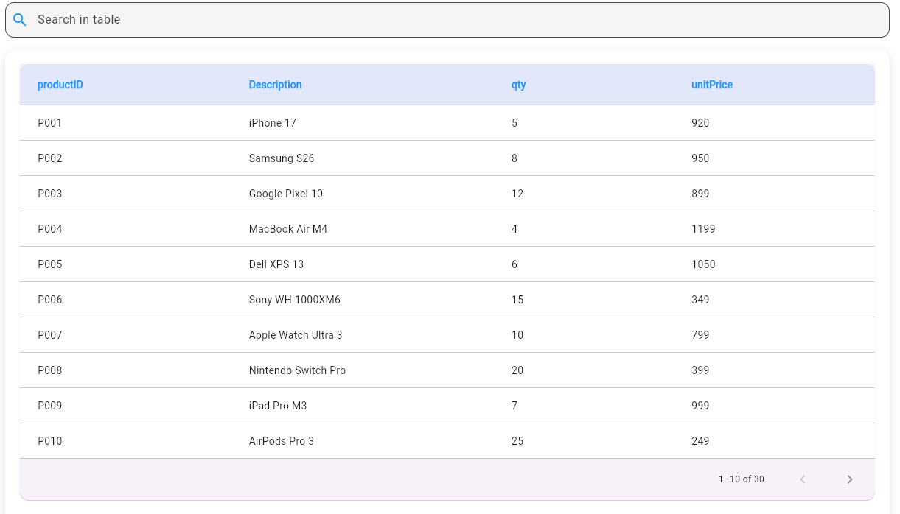

# Dynamic Dashboard Flutter Library

A **dynamic, modern, and customizable dashboard** widget for Flutter applications. It supports:

- Dynamic input data (`List<Map<String, dynamic>>`)
- Search filtering
- Horizontal & vertical scrolling
- Optional pagination
- Customizable colors and text styles
  - Responsive layout

---

## Features

- **Dynamic Columns & Rows:** The dashboard automatically adapts to the keys in your input `Map`.
- **Search Functionality:** Filter rows by any field or a subset of fields.
- **Pagination:** Optional paginated view with customizable rows per page.
- **Customizable Styles:** Primary color, accent color, header styles, and cell text styles.
- **Responsive Width:** Table and search bar adjust according to screen size.
- **Modern UI:** Rounded container, shadows, and clean design.

---

## Installation

Add this library to your Flutter project's pubspec.yaml:

```yaml
dependencies:
  dynamic_dashboard_library:
    path: ../dynamic_dashboard_library # Adjust the path as needed
```

Or if using from the same project:

```dart
import 'package:dynamic_dashboard_library/dynamic_dashboard_library.dart';
```

## Usage
```dart
import 'package:flutter/material.dart';
import 'package:dynamic_dashboard_library/dynamic_dashboard_library.dart';

final productsList = [
  {
    "productID": "P001",
    "Description": "iPhone 17",
    "qty": 5,
    "unitPrice": 920
  },
  {
    "productID": "P002",
    "Description": "Samsung S26",
    "qty": 8,
    "unitPrice": 950
  },
];

DynamicDashboard(
  data: productsList,                 // (REQUIRED) Your data as a List of Maps
  config: DashboardConfig(
    headerBgColor: primaryColor,      // (OPTIONAL) Set header background color
    searchBgColor: primaryColor,      // (OPTIONAL) Set search bar background color
    headerTextStyle: TextStyle(),     // (OPTIONAL) Customize header text style if needed
    cellTextStyle: TextStyle(),       // (OPTIONAL) Customize cell text style if needed
    searchableFields: ["productID"],  // (OPTIONAL) Enable search on the "productID" field
    rowsPerPage: 10,                  // (OPTIONAL) Set number of rows per page if you want pagination
    searchWidth: 300,                 // (OPTIONAL) Set width of the search bar or use 'auto' for automatic sizing
    tableWidth: 300,                  // (OPTIONAL) Set width of the table
    tableHeight: 300,                 // (OPTIONAL) Set height of the table
  ),
),
```

## Configuration Options

| Property           | Type | Default       | Description |
|--------------------|------|---------------|------------|
|  `headerBgColor`   | `Color` | `Colors.blue` | Header highlight color |
| `searchBgColor`    | `Color` | `Colors.grey` | Search field background color |
| `headerTextStyle`  | `TextStyle?` | `null`        | Custom header text style |
| `cellTextStyle`    | `TextStyle?` | `null`        | Custom cell text style |
| `searchableFields` | `List<String>?` | All fields    | Fields included in search |
| `rowsPerPage`      | `int?` | `null`        | Enables pagination |
| `searchWidth`      | `double?` | `Auto`        | Search field width |
| `tableWidth`       | `double?` | `1200`        | Maximum table width |
| `tableHeight`      | `double?` | `null`        | Fixed table height |

---

## Example Without Pagination

```dart
DynamicDashboard(
  data: productsList,
)
```

---

## Example With Pagination

```dart
DynamicDashboard(
  data: productsList,
  config: DashboardConfig(
    rowsPerPage: 10,
  ),
)
```

---

## Screenshots

| Normal Mode | Paginated Mode |
|:------------|:--------------|
|  |  |

---

## Data Requirements

- Input must be `List<Map<String, dynamic>>`
- All maps should contain consistent keys
- Nested maps are not supported
- Null values are allowed

---

## Advanced Customization

### Custom Header Style

```dart
DashboardConfig(
  headerTextStyle: TextStyle(
    fontSize: 16,
    fontWeight: FontWeight.bold,
    color: Colors.black,
  ),
)
```

---

## Limitations

- Does not support nested objects
- Sorting is not yet supported
- Large datasets (10k+ rows) may impact performance

---

## Roadmap

- [ ] Column sorting
- [ ] Row selection

---

## License

MIT License
